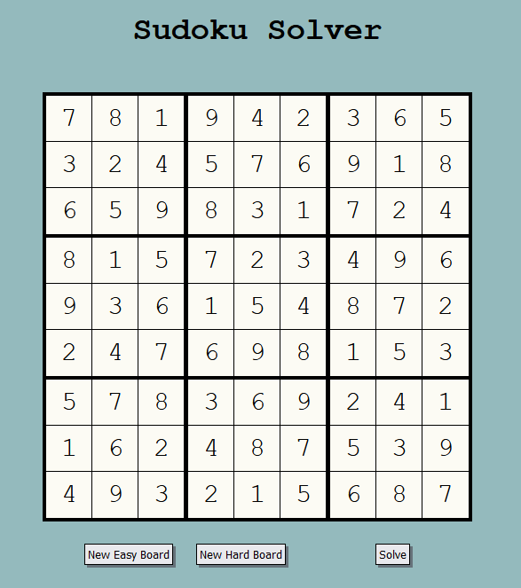

# Sudoku Solver

## [Link to live demo](https://adamanldo.github.io/sudoku-solver)

This is an app created with React and some vanilla Javascript (along with a bit of HTML/CSS) that solves Sudoku puzzles. It uses a recursive backtracking algorithm to ensure that a solution is found for each puzzle.

Easy puzzles are randomly taken from a list of 50 puzzles from the Project Euler Sudoku problem: https://projecteuler.net/project/resources/p096_sudoku.txt

Hard puzzles are randomly taken from this list: http://magictour.free.fr/top95